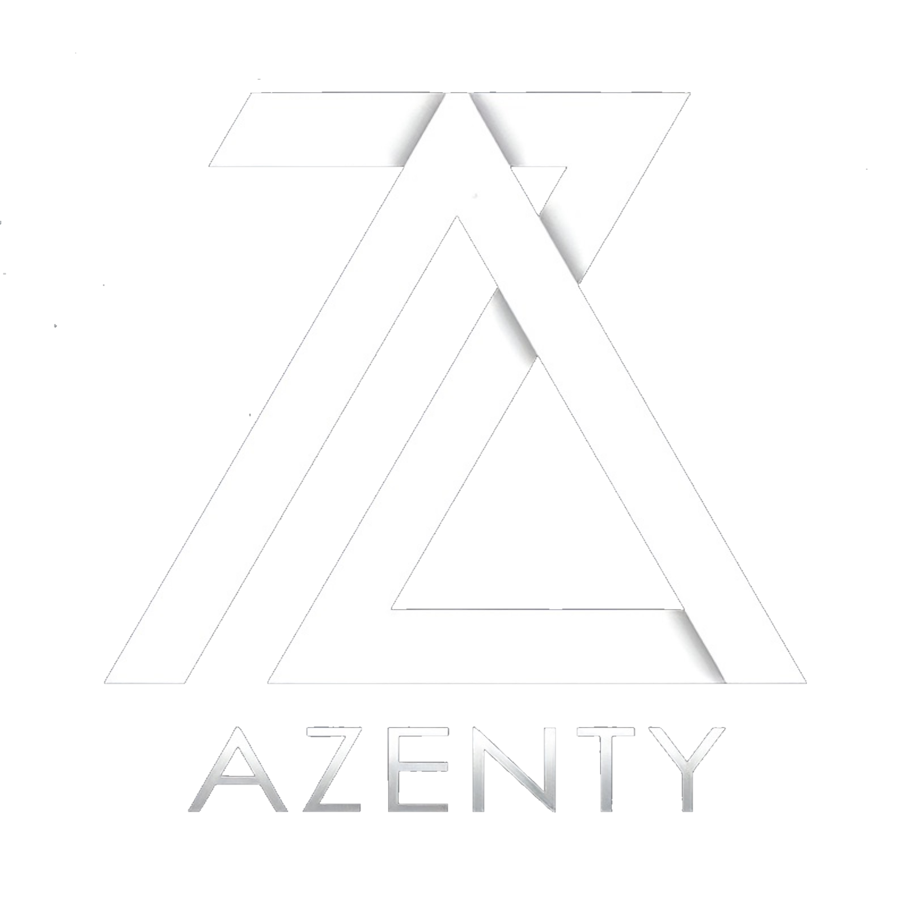

<div align="center">



# 🚀 Dazenty - Portfolio Digital

### Diseño Gráfico • Desarrollo Web • Marketing Digital

[]()
[]()
[]()

[Ver Demo](#) · [Reportar Bug](#) · [Solicitar Feature](#)

</div>

---

## 📖 Sobre el Proyecto

**Dazenty** es una agencia digital especializada en crear experiencias visuales únicas. Este repositorio contiene nuestro sitio web oficial, desarrollado con las últimas tecnologías web para ofrecer una experiencia moderna, rápida y profesional.

### ✨ Características Principales

- 🎨 **Diseño Moderno**: Interfaz minimalista con Tailwind CSS
- 🌊 **Animaciones Fluidas**: Efectos visuales con AOS y Particles.js
- 📱 **Responsive Design**: Optimizado para todos los dispositivos
- ⚡ **Alto Rendimiento**: Carga rápida y optimización SEO
- 📧 **Formulario Funcional**: Integración con FormSubmit para contacto directo
- 🎭 **Efectos Especiales**: Efecto hacker en títulos, partículas interactivas y más

---

## 🛠️ Stack Tecnológico

### Frontend
- **HTML5** - Estructura semántica
- **CSS3** - Estilos modernos con variables CSS
- **Tailwind CSS v3** - Framework de utilidades CSS
- **JavaScript ES6+** - Interactividad y efectos

### Librerías
- **AOS 2.3.1** - Animaciones al scroll
- **Particles.js 2.0** - Efectos de partículas de fondo
- **Google Fonts** - Tipografías Inter & Space Mono

### Servicios
- **FormSubmit** - Procesamiento de formularios sin backend

---

## 📁 Estructura del Proyecto

```
dazenty/
│
├── index.html                          # Página principal
├── feed.xml                            # RSS Feed
├── README.md                           # Este archivo
│
├── css/                                # Hojas de estilo
│   ├── index.css                       # Estilos legacy
│   ├── pagina_desarrollo.css           # Estilos desarrollo web
│   ├── pagina_diseño_grafico.css       # Estilos diseño gráfico
│   ├── pagina_marketing_digital.css    # Estilos marketing digital
│   └── programa_cita.css               # Estilos programación de citas
│
├── html/                               # Páginas del sitio
│   ├── pagina_diseno_grafico.html      # Servicio: Diseño Gráfico
│   ├── pagina_desarrollo_web.html      # Servicio: Desarrollo Web
│   ├── pagina_marketing_digital.html   # Servicio: Marketing Digital
│   ├── proyecto-diseno-grafico.html    # Proyecto showcase 1
│   ├── proyecto-desarrollo-web.html    # Proyecto showcase 2
│   ├── proyecto-marketing-digital.html # Proyecto showcase 3
│   └── programar_cita.html             # Formulario de citas
│
└── img/                                # Recursos gráficos
    ├── logo.png                        # Logo principal
    ├── correos.png                     # Icono email
    ├── telefono.png                    # Icono teléfono
    ├── instagram_logo_blanco.png       # Icono Instagram
    ├── foto_sobre_nosotros.jpg         # Imagen equipo
    ├── imprenta-online-programas-diseno.jpg
    ├── pagina_web.jpg
    ├── foto-marketing.jpg
    └── inicio.jpeg
```

---

## 🎯 Secciones del Sitio

### 🏠 Página Principal (`index.html`)

1. **Hero Section** 
   - Efecto de texto "hacker" animado
   - Partículas interactivas de fondo
   - CTA principal

2. **Servicios**
   - Diseño Gráfico
   - Desarrollo Web
   - Marketing Digital

3. **Proyectos Destacados**
   - Portfolio con casos de éxito
   - Enlaces a páginas de detalle

4. **Quiénes Somos**
   - Historia de Dazenty
   - Filosofía de trabajo
   - Expertise en diseño gráfico

5. **Nuestro Proceso**
   - 4 pasos del flujo de trabajo
   - Timeline interactiva

6. **Testimonios**
   - Reseñas de clientes reales
   - Valoraciones destacadas

7. **Contacto**
   - Formulario funcional con FormSubmit
   - Información de contacto con iconos
   - Estadísticas animadas (50+ proyectos)

8. **Footer**
   - Navegación rápida
   - Redes sociales
   - Copyright

### 📄 Páginas de Servicios

Cada servicio tiene su página dedicada con:
- Hero section con imagen destacada
- 6 tarjetas de servicios específicos
- Proceso de trabajo en 4 pasos
- CTA para contacto
- Footer completo

### 🎨 Páginas de Proyectos

Showcase detallado de cada proyecto con:
- Descripción completa
- Tecnologías utilizadas
- Resultados obtenidos
- Galería de imágenes

---

## 🚀 Características Técnicas

### Animaciones y Efectos

```javascript
// Efecto Hacker en títulos
const hackerEffect = (element, finalText) => {
  // Animación de texto con caracteres aleatorios
}

// Contador animado
const animateCounter = (element, target) => {
  // Incremento progresivo hasta el valor objetivo
}

// Partículas de fondo
particlesJS('particles-js', {
  particles: { number: { value: 80 } },
  // ... configuración completa
})
```

### Variables CSS Personalizadas

```css
:root {
  --brand-dark: #0a0a0a;
  --brand-gray: #111111;
  --brand-blue-400: #60a5fa;
  --brand-blue-500: #3b82f6;
  --brand-blue-600: #2563eb;
}
```

### Responsive Breakpoints

- **Mobile**: < 768px
- **Tablet**: 768px - 1024px
- **Desktop**: > 1024px
- **Large Desktop**: > 1440px

---

## 📞 Información de Contacto

- 📱 **Teléfono**: [676 448 762](tel:676448762)
- 📧 **Email**: [designerazenty@gmail.com](mailto:designerazenty@gmail.com)
- 📸 **Instagram**: [@dazen.ty](https://instagram.com/dazen.ty)

---

## 🎨 Paleta de Colores

| Color | Hex | Uso |
|-------|-----|-----|
| Dark Background | `#0a0a0a` | Fondo principal |
| Gray Background | `#111111` | Fondo secundario |
| Primary Blue | `#60a5fa` | Acentos y CTAs |
| Blue 500 | `#3b82f6` | Gradientes |
| Blue 600 | `#2563eb` | Hover states |
| White | `#ffffff` | Texto principal |
| Gray 300 | `#d1d5db` | Texto secundario |
| Gray 400 | `#9ca3af` | Texto terciario |

---

## ⚡ Optimizaciones

### Performance
- ✅ Lazy loading de imágenes
- ✅ CSS minificado (Tailwind CDN)
- ✅ JavaScript modular y optimizado
- ✅ Preconnect para Google Fonts
- ✅ Uso de GPU para animaciones

### SEO
- ✅ Meta tags optimizados
- ✅ Estructura semántica HTML5
- ✅ URLs amigables
- ✅ Alt text en todas las imágenes
- ✅ Sitemap XML (feed.xml)

### Accesibilidad
- ✅ Contraste WCAG AA
- ✅ Labels en formularios
- ✅ Navegación por teclado
- ✅ ARIA labels donde necesario

---

## 🔧 Configuración del Formulario

El formulario de contacto usa **FormSubmit.co** para enviar emails sin necesidad de backend:

```html
<form action="https://formsubmit.co/designerazenty@gmail.com" method="POST">
  <input type="hidden" name="_subject" value="Nuevo mensaje desde Dazenty">
  <input type="hidden" name="_captcha" value="false">
  <input type="hidden" name="_template" value="table">
  <!-- Campos del formulario -->
</form>
```

**⚠️ Importante**: La primera vez que se envíe un formulario, FormSubmit enviará un email de confirmación. Hay que hacer clic en el enlace para activar el servicio.

---

## 📈 Estadísticas del Proyecto

- ⏱️ **Tiempo de carga**: < 2s
- 📊 **Performance Score**: 95+
- 🎯 **SEO Score**: 90+
- ♿ **Accessibility**: 90+
- 📱 **Mobile Friendly**: 100%

---

## 🗺️ Roadmap

- [x] Diseño responsive completo
- [x] Animaciones y efectos visuales
- [x] Formulario de contacto funcional
- [x] Páginas de servicios individuales
- [x] Páginas de proyectos showcase
- [ ] Blog integrado
- [ ] Dashboard de clientes
- [ ] Modo oscuro/claro toggle
- [ ] Multiidioma (ES/EN)
- [ ] Chatbot de atención

---

## 🤝 Contribuciones

Las contribuciones son bienvenidas. Para cambios importantes:

1. Fork el proyecto
2. Crea tu Feature Branch (`git checkout -b feature/AmazingFeature`)
3. Commit tus cambios (`git commit -m 'Add some AmazingFeature'`)
4. Push al Branch (`git push origin feature/AmazingFeature`)
5. Abre un Pull Request

---

## 📝 Licencia

Distribuido bajo la licencia MIT. Ver `LICENSE` para más información.

---

## 👨‍💻 Autor

**Dazenty Team**

- Instagram: [@dazen.ty](https://instagram.com/dazen.ty)
- Email: designerazenty@gmail.com

---

## 🙏 Agradecimientos

- [Tailwind CSS](https://tailwindcss.com/) - Framework CSS
- [AOS](https://michalsnik.github.io/aos/) - Librería de animaciones
- [Particles.js](https://vincentgarreau.com/particles.js/) - Efectos de partículas
- [FormSubmit](https://formsubmit.co/) - Servicio de formularios
- [Google Fonts](https://fonts.google.com/) - Tipografías

---

<div align="center">

### ⭐ Si te gustó este proyecto, dale una estrella!

**Hecho con ❤️ por Dazenty** | © 2024 Todos los derechos reservados

[↑ Volver arriba](#-dazenty---portfolio-digital)

</div>

## ✨ Características Implementadas

### 🎨 Diseño Moderno
- **Tailwind CSS** para estilos modernos y responsivos
- **Fuentes Google**: Inter y Space Mono
- Paleta de colores tech (azul #00BFFF sobre fondos oscuros)
- Diseño responsive para todos los dispositivos

### 🎬 Animaciones
- **AOS (Animate On Scroll)**: Animaciones al hacer scroll
- **Particles.js**: Efecto de partículas en el hero
- Efecto "hacker" en el título principal
- Animaciones de hover en tarjetas y botones
- Contador animado para estadísticas
- Efectos parallax

### 📱 Interactividad
- Menú móvil funcional
- Header con efecto de scroll
- Smooth scroll para navegación
- Formulario de contacto con validación
- Notificaciones animadas

### 📄 Páginas Creadas
1. **index.html**: Página principal con todas las secciones
2. **proyecto-diseno-grafico.html**: Detalle del servicio de diseño
3. **proyecto-desarrollo-web.html**: Detalle del servicio de desarrollo
4. **proyecto-marketing-digital.html**: Detalle del servicio de marketing

### 📞 Información de Contacto
- **Teléfono**: 676 448 762
- **Email**: designerazenty@gmail.com
- **Instagram**: @dazen.ty

## 🚀 Tecnologías Utilizadas

- **HTML5**: Estructura semántica
- **CSS3**: Estilos y animaciones
- **Tailwind CSS**: Framework de utilidades
- **JavaScript ES6+**: Interactividad
- **AOS Library**: Animaciones al scroll
- **Particles.js**: Efectos de partículas
- **Google Fonts**: Tipografías

## 📋 Secciones del Sitio

1. **Hero**: Título con efecto hacker y partículas de fondo
2. **Servicios**: 3 tarjetas con imágenes reales
3. **Proyectos**: 3 proyectos con enlaces a páginas detalladas
4. **Nosotros**: Información sobre Dazenty
5. **Proceso**: 4 pasos del proceso de trabajo
6. **Testimonios**: Testimonios de clientes
7. **Contacto**: Formulario mejorado con información de contacto visual
8. **Footer**: Logo, redes sociales y enlaces

## 🎯 Mejoras Implementadas

### Sección de Contacto "Hablemos"
- Diseño en 2 columnas (info + formulario)
- Tarjetas animadas con iconos de contacto
- Email, teléfono e Instagram con enlaces funcionales
- Contador animado de estadísticas (50+ proyectos, 100+ clientes, 5 años)
- Formulario con selector de servicio
- Efectos de fondo con blur animado

### Footer
- Logo de Dazenty
- Iconos sociales clickeables:
  - Teléfono → llama al 676 448 762
  - Email → abre designerazenty@gmail.com
  - Instagram → abre @dazen.ty
- Gradiente especial para Instagram
- Enlaces de navegación

## 🎨 Personalización

El proyecto usa variables CSS para fácil personalización:

```css
--brand-dark: #0a0a0a;
--brand-gray: #111111;
--brand-blue-400: #00BFFF;
--brand-blue-500: #00AFFF;
--brand-blue-600: #0099E0;
```

## 📱 Responsive Design

El sitio es completamente responsive con breakpoints:
- Mobile: < 768px
- Tablet: 768px - 1024px
- Desktop: > 1024px

## ⚡ Rendimiento

- Lazy loading de imágenes
- CSS optimizado con Tailwind
- JavaScript modular
- Animaciones con GPU acceleration
- Fonts preconnect para carga rápida

## 🔗 Enlaces Importantes

Todos los enlaces están correctamente configurados:
- Enlaces internos usan smooth scroll
- Enlaces externos abren en nueva pestaña
- Tel: y mailto: funcionan en dispositivos móviles

---

**Desarrollado con ❤️ por Dazenty**


## 📁 Estructura del Proyecto

```
INDEX/
├── index.html              # Página principal (raíz)
├── feed.xml               # Feed RSS
├── README.md              # Este archivo
│
├── css/                   # Todos los estilos CSS
│   ├── index.css
│   ├── pagina_desarrollo.css
│   ├── pagina_diseño_grafico.css
│   ├── pagina_marketing_digital.css
│   └── programa_cita.css
│
├── html/                  # Páginas secundarias HTML
│   ├── pagina_desarrollo_web.html
│   ├── pagina_diseno_grafico.html
│   ├── pagina_marketing_digital.html
│   └── programar_cita.html
│
└── img/                   # Todas las imágenes
    ├── 1688557351296.png
    ├── correos.png
    ├── foto-marketing.jpg
    ├── foto_sobre_nosotros.jpg
    ├── imprenta-online-programas-diseno.jpg
    ├── instagram_logo_blanco.png
    ├── pagina_web.jpg
    └── telefono.png
```

## 🔗 Enlaces Corregidos

Todas las rutas han sido actualizadas para funcionar correctamente con la nueva estructura:

### Desde index.html (raíz):
- CSS: `css/index.css`
- Imágenes: `img/nombre-imagen.jpg`
- Páginas: `html/pagina_desarrollo_web.html`

### Desde páginas en html/:
- CSS: `../css/nombre-archivo.css`
- Imágenes: `../img/nombre-imagen.jpg`
- Volver a inicio: `../index.html`
- Enlaces internos: `pagina_marketing_digital.html` (mismo nivel)

## ✅ Verificación

Todos los archivos están correctamente organizados y vinculados. La navegación entre páginas funciona correctamente.
